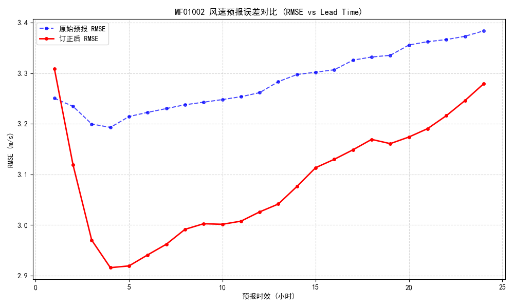
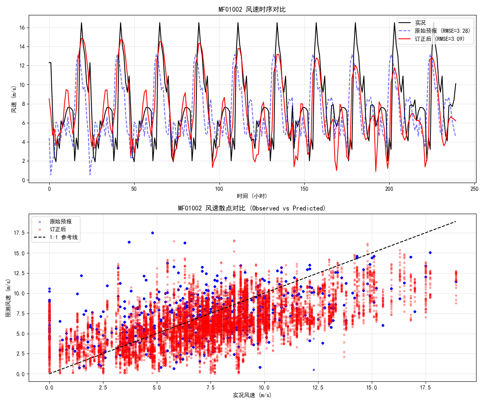

### 代码说明

```shell
└─train                                                                           
    └─runs 
    └─train_evaluate_vector_new 		# 原始预报结果与模型修订后的结果的RMSE评估
    └─train_evaluate 					# 对于订正后的模型计算RMSE以及散点图
```

### 研究计划

- [ ] 评估GRAPES风场2024年的96小时的RMSE
- [ ] 若GRAPES风场在某个时间节点出现了模型的迭代，那么使用这种方式进行学习是否会存在问题

### train_evaluate_vector_new.py

 `train_evaluate_vector_new.py` 的主要作用是**对训练好的 TimeSeriesTransformer 模型在测试集上进行“分时效”的评估和可视化**。

它不再只是看一个总体的误差数值，而是深入分析**每一小时预报时效（Lead Time）**的表现，并将其与**原始数值预报（NWP）**进行对比，看看深度学习模型到底在哪里准，在哪里不准。

以下是代码逻辑的详细步骤梳理：

#### 第一阶段：准备工作 (Setup & Data)

1. **加载配置与数据 (`load_and_prepare_data`)**:
   - 读取 `CONFIG` 配置。
   - 加载清洗后的 CSV 数据。
   - **归一化**：使用 `scaler` 将数据缩放到 0-1 之间（便于模型训练）。
   - **制作样本 (`create_samples`)**: 将数据切分为 `(Encoder输入, Decoder输入, Target目标)` 的序列格式。
2. **划分测试集**:
   - 按照 `80% / 20%` 的比例，截取数据的**最后 20%** 作为验证/测试集 (`test_enc`, `test_dec`, `test_y`)。
   - 封装进 `DataLoader`，设置 `batch_size=32`。
3. **加载最佳模型**:
   - 初始化 `TimeSeriesTransformer` 模型结构。
   - 加载权重文件 `multi_site_transformer_best.pth`。
   - 开启 `model.eval()` 模式（关闭 Dropout 等训练专用层）。

#### 第二阶段：模型推理 (Inference)

1. **批量预测**:
   - 遍历 `DataLoader`，将数据送入 GPU。
   - **模型输出 (`output`)**：得到模型对风场 U/V 分量的修正预测值。
   - 同时保留了 `target` (实况真值) 和 `tgt` (原始数值预报 NWP，作为 Baseline)。
2. **数据拼接 (`np.concatenate`)**:
   - 因为预测是按 Batch 进行的，循环结束后将所有 Batch 的结果拼起来，形成巨大的数组。
   - 此时数据形状为 `(总样本数, 预报步长T, 特征数F)`。

#### 第三阶段：数据后处理 (Post-Processing) —— **核心难点**

1. **维度展平 (Flatten)**:
   - 为了使用 `scaler.inverse_transform`（它只接受 2D 矩阵），代码将 `(样本数, 时间步, 特征数)` 展平为 `(样本数*时间步, 特征数)`。
2. **反归一化 (Inverse Transform)**:
   - 将预测值、实况值、原始预报值从 0-1 的数值还原为真实的物理量（如 m/s）。
3. **维度还原 (Reshape Back to 3D)**:
   - **最关键的一步**：将反归一化后的数据重新变回 `(N, T, Features)` 的 3D 形状。
   - 这样才能在后续步骤中，按“第1小时”、“第2小时”这样的时间轴来切分数据。

#### 第四阶段：物理量计算与提取

1. **单站点提取**:
   - 代码目前只选取了第一个站点 (`site_idx = 0`) 进行深入分析。
   - 分别提取该站点的 U 分量和 V 分量。
2. **矢量合成 (`uv_to_speed_direction`)**:
   - 利用勾股定理 $Speed = \sqrt{U^2 + V^2}$ 计算**风速**。
   - 利用 `arctan2` 计算**风向**角度，并转换为气象定义（0度为北风，顺时针旋转）。
   - **结果**：得到了三组风速数据 —— **模型预测风速**、**实况风速**、**原始预报风速**。

#### 第五阶段：评估与绘图 (Evaluation & Visualization)

1. **分时效计算 RMSE**:
   - 这是一个循环：`for t in steps (0 到 23)`。
   - 在每一个时间步 $t$，切片取出所有样本在该时刻的风速。
   - 分别计算：
     - **订正后 RMSE**：模型预测 vs 实况。
     - **原始 RMSE**：原始预报 vs 实况。
2. **打印报表**:
   - 计算提升率 `(原始RMSE - 订正RMSE) / 原始RMSE`。
   - 在控制台打印关键时间点（H+1, H+4, ... H+24）的对比数据。
3. **绘制对比图**:
   - 绘制折线图：X轴为预报时效（1-24小时），Y轴为RMSE。
   - **蓝线**：原始预报误差。
   - **红线**：订正后误差。
   - 保存为 `rmse_comparison_lead_time.png`。

------

评估后的RMSE对比图




#### 总结

这段代码就是一个标准的**“离线评估流水线”**。

如果您后续要引入 **CNN+Transformer** 的融合模型：

1. **这个评估脚本 (`evaluate_comprehensive`) 几乎不需要大改**。因为无论模型内部怎么变，只要输出的格式依然是 `(Batch, Time, Features)`，评估逻辑是一样的。
2. **变化主要在 `train_transformer.py`**：需要在模型定义（Class）里加入 CNN 层，以及在数据加载（Dataset）部分确保返回的数据带有空间维度。

### train_evaluate.py

